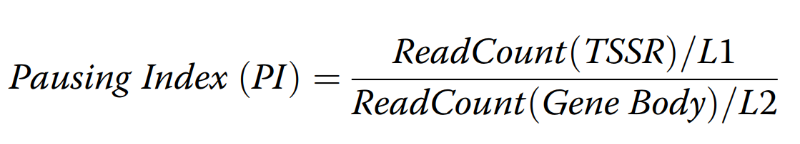

# INTODUCTION
**In brief, PIC is a program that helps you calculating pausing index from your next-generation sequencing (NGS) samples at functional regions (TSS & Gene body).**

RNAPII pausing is a transcription event that RNAPII moves to -30-50bp of TSS and pauses there after engaged. Only when some protein complex like pTEFb come to release the Pausing, RNAPII could elongate to gene body and produce full-length RNA. RNAPII has been implicated as a critical rate-limit step and irreplaceable check point for mRNA transcription.

We developed PIC for easier and more accurate calculation of pausing index. A user can use default or self-defined regions around TSS and gene body to generate the pausing index. Users can use more stringent filtrations, and they can use different modes to output their preferences.


# PREREQUISITE
You need Python 2.7, samtools and bedtools to be able to use PIC. 

# INSTALL
Extract the package or the scripts to the folder containing your data.

# USAGE

1. Set the locations for TSS regions (TSSR) and gene body regions (GBR). Here you can use `extract_genomic_locations.py` to get locations from a gtf file(any unnecessary information like time and version this kinds of tag information should be manually excluded ). This returns 3 outcomes: gene_tss.bed, gene_GB.bed and gene_info.bed. Of course, you can make them bed files by your own .
	```
	python extract_genomic_locations.py --gtf hg19.gtf --TSSup 50 --TSSdown 300 --GBdown 3000 --gsize ~/Ref/GRCh37/hg19.genome
	```
	The outputs look like this:
  
	gene_tss.bed:
	```
	chr1	11820	12168	ENST00000456328.2	.	+
	chr1	11823	12171	ENST00000515242.2	.	+
	chr1	11825	12173	ENST00000518655.2	.	+
	```
	gene_GB.bed
	```
	chr1	12168	17408	ENST00000456328.2	.	+
	chr1	12171	17411	ENST00000515242.2	.	+
	chr1	12173	17408	ENST00000518655.2	.	+
	```
	gene_info.bed
	```
	chr1	11869	14409	ENST00000456328.2	.	+	ENSG00000223972.4	DDX11L1
	chr1	11872	14412	ENST00000515242.2	.	+	ENSG00000223972.4	DDX11L1
	chr1	11874	14409	ENST00000518655.2	.	+	ENSG00000223972.4	DDX11L1
	```
1. Many approaches can be used to calculate read counts. We offers you `tag_RPM.py` to get the tag counts from BAM files. Also, other softwares like [spp](http://compbio.med.harvard.edu/Supplements/ChIP-seq/tutorial.html) and [Homer](http://homer.ucsd.edu/homer/ngs/quantification.html) are also suggested. You can filter your BAM using —-min to get reads with a minimum mapping quality. The script will normalize the read counts by the total number of mapped reads such that we display read counts in RPM (reads per million). This will output 2 files: tag_count.txt and tag_count_normalize.txt.
	```
	python tag_RPM.py --chip HUVEC_Pol2.bam --input HUVEC_Pol2_input.bam --min 30 --tss gene_tss.bed --gb gene_GB.bed
	```
	tag_count_normalize.txt:
  column1 refers to transcript_id, column2-4 refer to location of TSSR, column5-7 refer to location of GBR, column8 refers to strand, column9-12 refer to normalized tag counts of ChIP_TSS, Input_TSS, ChIP_GB, Input_GB.
	```
	ENST00000427426.1	chr1	568088	568436	chr1	568436	571817	+	0.125	0.125	71.5	24.75
	ENST00000467115.1	chr1	568866	569214	chr1	569214	572120	+	41.375	0.1875	54.5	24.5
	ENST00000514057.1	chr1	569027	569375	chr1	569375	572755	+	41.375	0.1875	30.0833333333	24.4375
	```
1. `Pausing_Index.py` calculates pausing index based on the table of normalized tag counts. For PI calculation, we subtract normalized ChIP signal in each region against normalized input signal in each region. Then we calculate the pausing index based on the formula. To consolidate PI values from multiple isoforms, `--min` is used to set a bottom line for the minimum signal at TSSR. You can use `--longest` to only retain the isoform with longest length, otherwise, the script will choose the isoform with the strongest signal at TSSR.
	 
	```
	python Pausing_Index.py --tags tag_count_normalize.txt --anno gene_info.txt
	```    

# Command Line

## extract_genomic_locations.py
Usage: Gene Info extraction [-h] [--gif GTF] [--TSSup TSSUP] [--TSSdown TSSDOWN] [--GBdown GBDOWN] [--gsize GSIZE]
### Optional arguments:
`-h`, —help	show this help message and exit

`--gtf` GTF	the gene annotation file. You should delete titles in this file if exists. Also, please make consistence between the gif and you reference genome. The gtf annotation file can be downloaded from websites like UCSC and GENCODE.

`--TSSup` TSSUP	the distance upstream of TSS

`--TSSdown` TSSDOWN	the distance downstream of TSS

`--GBdown` GBDOWN	the distance downstream of the end of gene body

`--gsize` GSIZE	the chromosome size of the genome, each line: chromosome<tab>length(in bp)<Enter> . This file can be made by samtools radix on your reference genome and select useful columns using cut option in unix command line.

## tag_RPM.py
usage: Calculation RPM for regions [-h] [--chip CHIP] [--input INPUT] [--min MIN] [--tss TSS] [--gb GB]
### optional arguments:
`-h`, --help	show this help message and exit

`--chip` CHIP	BAM files for ChIP-seq

`--input` INPUT	BAM files for input ChIP-seq

`--min` MIN	Skip alignments with MAPQ smaller than INT[20]

`--tss` TSS	bed file for tss regions

`--gb` GB	bed file for gene body regions

## Pausing_Index.py
usage: Calculation of Pausing Index [-h] [--tags TAGS] [--min MIN] [--longest] [--anno ANNO]
### optional arguments:
`-h`, --help	show this help message and exits

`--tags` TAGS	tag counts for each gene

`--min` MIN	minimum ChIP signal at TSSR[0.001]

`--longest`	The script will turn to output the longest isoform if this mode is turned on, otherwise, the script will output the isoform 		with the strongest signal at TSSR.

`--anno` ANNO	offer gene symbols to gene_id

# Publication
Chen, J., Y. Fu, D.S. Day, Y. Sun, S. Wang, X. Liang, F. Gu, F. Zhang, S.M. Stevens, P. Zhou, K. Li, Y. Zhang, R.-z. Lin, L.E.H. Smith, J. Zhang, K. Sun, J.M. Melero-Martin, Z. Han, P.J. Park, B. Zhang, and W.T. Pu (2017). "VEGF amplifies transcription through ETS1 acetylation to enable angiogenesis." Nature Communications 8(1): p. 383.
Day, D. S., Zhang, B., Stevens, S. M., Ferrari, F., Larschan, E. N., Park, P. J., & Pu, W. T. (2016). Comprehensive analysis of promoter-proximal RNA polymerase II pausing across mammalian cell types. Genome biology, 17(1), 120.

